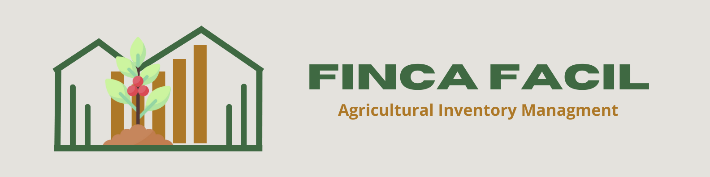

# Spanish
**FincaFácil** es un software diseñado para la gestión de inventarios, enfocado en un sector muchas veces olvidado: el campo.

Su misión es ayudar a las generaciones de agricultores y productores a administrar de manera eficiente sus productos y ventas, permitiendo un control total y centralizado de la información.

Con **FincaFácil**, puedes mantener tu inventario siempre actualizado gracias a sus diversas funciones, como la gestión de cantidades de productos, el registro de fechas de cosecha, la clasificación por categorías, la administración de almacenes, el seguimiento de ventas y la gestión de clientes, entre muchas otras opciones.

### Características Principales
- 📦 Gestión de inventario: Control de productos y cantidades.
- 🌱 Registro de cosechas: Anotación de fechas y detalles.
- 🏬 Administración de almacenes: Organización eficiente.
- 📊 Seguimiento de ventas: Registro detallado de transacciones.
- 📇 Gestión de clientes: Almacén de información clave.
- 📜 Reportes y estadísticas: Análisis de datos.

### Tecnologías Utilizadas 
**Backend (Provisional)⚙️**

- Lenguajes: Java
- Frameworks: Spring Boot
- Bases de datos: Mysql
  
**Frontend (No establecido) 💻**

  -
  
**Diseño (No establecido) 🎨**

  -

---

**🚨 Importante:** El sistema se encuentra en una fase muy temprana de desarrollo. El objetivo es convertirlo en un proyecto real, optimizado y listo para producción, con un diseño intuitivo y funcional.
Soy un desarrollador junior en backend, apasionado por la tecnología y con el propósito de crear soluciones que ayuden a las personas.

**🆘 Apoyo:** Estoy buscando personas interesadas en formar parte de este proyecto para revolucionar y apoyar la industria agropecuaria, beneficiando tanto a las generaciones actuales como a las futuras.
Si quieres unirte a este desafío, ¡contáctame! 🚀

### Contactame
- 📞 [WhatsApp](https://wa.me/573207032077)
- ✉️ santi10gz10@gmail.com
- 💬 [Linkedin](https://www.linkedin.com/in/santiago-garcia-backendtech/)

# English

**FincaFácil** is a software designed for inventory management, focused on a sector that is often overlooked: agriculture.  

Its mission is to help generations of farmers and producers efficiently manage their products and sales, allowing for total and centralized control of information.  

With **FincaFácil**, you can keep your inventory always up to date thanks to its various features, such as product quantity management, harvest date tracking, category classification, warehouse administration, sales monitoring, and customer management, among many other options.  

### Main Features  
- 📦 Inventory Management: Control of products and quantities.  
- 🌱 Harvest Tracking: Record dates and details.  
- 🏬 Warehouse Administration: Efficient organization.  
- 📊 Sales Monitoring: Detailed transaction tracking.  
- 📇 Customer Management: Store key customer information.  
- 📜 Reports and Statistics: Data analysis.  

### Technologies Used

**Backend (Provisional) ⚙️**  
- Languages: Java  
- Frameworks: Spring Boot  
- Databases: MySQL  

**Frontend (Not established) 💻** 

-  

**Design (Not established) 🎨**  

-  

---  

🚨 **Important:** The system is in a very early development stage. The goal is to turn it into a real, optimized, and production-ready project with an intuitive and functional design.  
I am a junior backend developer, passionate about technology, with the purpose of creating solutions that help people.  

🆘 **Support:** I am looking for people interested in joining this project to revolutionize and support the agricultural industry, benefiting both current and future generations.  
If you want to be part of this challenge, contact me! 🚀  

### **Contact Me**
- 📞 [WhatsApp](https://wa.me/573207032077)
- ✉️ santi10gz10@gmail.com
- 💬 [Linkedin](https://www.linkedin.com/in/santiago-garcia-backendtech/)
